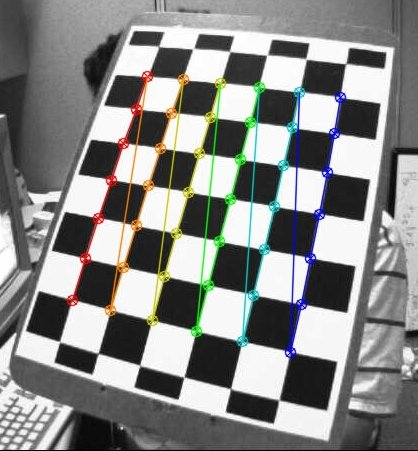

# 相机校准

## 目标

在这一部分中，我们将了解关于：

- 相机畸变的类型
- 如何找出相机的固有属性和可变属性
- 如何利用这些属性校准相机图像

## 基础

一些针孔摄像机会有严重的图像畸变的问题。其中径向畸变和切向畸变是两种主要的畸变现象。

径向畸变使得直线变得弯曲。切向畸变使得离图像中心点越远的点看上去更远。举个例子，如下图像展示了一个两条边界被红线标记的棋盘。但是，你可以看到棋盘的边缘不仅不是直线，而且与红线偏差很大。所有预期的直线都弯曲了。访问[畸变(光学)](https://en.wikipedia.org/wiki/Distortion_%28optics%29)来获取更多信息。


<center>calib radial image</center>

径向畸变可表示为如下公式：
$$
{\notag}
x_{distorted} = x( 1 + k_1 r^2 + k_2 r^4 + k_3 r^6) \\ y_{distorted} = y( 1 + k_1 r^2 + k_2 r^4 + k_3 r^6)
$$
相似的，发生切向畸变是因为摄像镜头未完全平行于图像平面。所以，图像中的某些区域可能看起来比预期的更近。切向畸变可表示如下公式：
$$
{\notag}
x_{distorted} = x + [ 2p_1xy + p_2(r^2+2x^2)] \\ y_{distorted} = y + [ p_1(r^2+ 2y^2)+ 2p_2xy]
$$
简而言之，我们需要找到上面的五个参数，其被称为畸变系数，由下式给出：
$$
{\notag}
Distortion \; coefficients=(k_1 \hspace{10pt} k_2 \hspace{10pt} p_1 \hspace{10pt} p_2 \hspace{10pt} k_3)
$$
除此之外，我们还需要一些其他信息，像是相机的固有属性和可变属性。固有属性是每个相机的特有属性。其中包括像是焦距$$(f_x,f_y)​$$和光心$$(c_x, c_y)​$$。焦距和光心可以被用于创建相机矩阵，用于消除相机镜头特有属性造成的畸变。每个相机的相机矩阵都是独一无二的，所以一旦我们计算出来，便可以在同一相机所拍摄的其他图像上重复使用。其表示为3x3的矩阵：
$$
{\notag}
camera \; matrix = \left [ \begin{matrix} f_x & 0 & c_x \\ 0 & f_y & c_y \\ 0 & 0 & 1 \end{matrix} \right ]
$$
外部参数对应于旋转和平移矢量，其将3D点的坐标平移到坐标系。

对于立体应用方面，这些畸变现象首先需要解决。为了寻找到这些参数，我们必须提供一些被明确定义的图像(比如棋盘)。我们可以寻找到一些我们早就知道相对位置的点(比如棋盘的方格的角点)。我们也知道这些点在真实世界中的坐标以及图像中的坐标，由此我们便可以解出畸变系数。如果想要获取更好的结果，我们需要至少10个测试图像。

## 代码

正如上面所言，我们至少需要10个图像用以相机校准。OpenCV提供了一些棋盘的图片(参见samples/data/left01.jpg – left14.jpg)，所以我们将利用这些图像。思考一个棋盘的图像。相机校准所需要的重要输入数据便是3D真实世界点的集合以及在图像中这些点所对应的2D坐标。我们可以轻易从这些图像中寻找到2D图像点。(这些图像点是棋盘中两个黑色块相交的位置)。

那真实世界中的3D点又如何呢？这些图像于同一相机静止拍摄，其中的棋盘放置于不同的位置与方向。所以我们需要知道$$(X,Y,Z)​$$的值。但是为了简单起见，我们可以说棋盘在XY平面保持静止，(所以 Z 恒等于 0 )而相机是移动物件。这个考量帮助我们可以仅找出X，Y的值。现在对于X，Y的值，我们可以简单地传递像是(0,0), (1,0), (2,0), ... 之类的点用于表示点的位置。在此之下，我们得到的结果将是棋盘方块相对的大小。但是如果我们知道棋盘方块的大小，(大约30mm)，我们便可以传递像(0,0), (30,0), (60,0), ...这样的值。因此，我们的到的结果也是mm为单位的。(在这种情况下，我们不知道方块尺寸，因为我们没有拍摄这些图像，所以我们将方块尺寸作为参数传入)。

3D点被称作**对象点**，2D点被称作**图像点**

### 标定

所以为了寻找到棋盘上的图案，我们可以使用一个函数，[**cv.findChessboardCorners()**](https://docs.opencv.org/4.0.0/d9/d0c/group__calib3d.html#ga93efa9b0aa890de240ca32b11253dd4a)。我们同样需要传递我们寻找的图案类型，像是8x8网格，5x5网格之类的。在这个例子中，我们使用7x6的网格(一般的棋盘规格是8x8网格和7x7的内角)。它返回角点和阈值，如果成功找到所有角点，则返回True。这些角落将按顺序放置（从左到右，从上到下）

#### 参考

- 这个函数可能不能够找到所有图像中需求的图案。所以，有一个很好的选项便是[**编写**](https://docs.opencv.org/4.0.0/da/d56/classcv_1_1FileStorage.html#a26447446dd3fa0644684a045e16399fe)代码，以便它启动相机并检查每一帧是否需要获取图案。一旦图案确定了，便寻找角点并存入一个列表当中。同样的，在阅读下一帧之前提供一些间隔，以便我们可以在不同的方向上调整我们的棋盘。持续此过程，直至获得所需要的优良图案。甚至在我们在这里给出的示例当中，我们也无法确定在我们给出的14张图像中有多少是优良的。由此，我们必须[**读入**](https://docs.opencv.org/4.0.0/de/dd9/classcv_1_1FileNode.html#ab24433dde37f770766481a91983e5f44)所有的图像并仅选取好的图像。

- 除了棋盘，我们也可使用圆形网格。在此之下，我们必须使用[**cv.cornerSubPix()**](https://docs.opencv.org/4.0.0/dd/d1a/group__imgproc__feature.html#ga354e0d7c86d0d9da75de9b9701a9a87e)函数用以寻找图案。使用圆形网格使得相机需更少的图像便可足以校准。

一旦我们找到了角点，我们可以使用[**cv.cornerSubPix()**](https://docs.opencv.org/4.0.0/dd/d1a/group__imgproc__feature.html#ga354e0d7c86d0d9da75de9b9701a9a87e)函数来提高它们的准确性。我们同样可以使用 [**cv.drawChessboardCorners()**](https://docs.opencv.org/4.0.0/d9/d0c/group__calib3d.html#ga6a10b0bb120c4907e5eabbcd22319022)函数绘制图案。所有步骤均包含在下面代码当中：

```python
import numpy as np
import cv2 as cv
import glob

# 终止标准
criteria = (cv.TERM_CRITERIA_EPS + cv.TERM_CRITERIA_MAX_ITER, 30, 0.001)

# 准备对象点, 如 (0,0,0), (1,0,0), (2,0,0) ....,(6,5,0)
objp = np.zeros((6*7,3), np.float32)
objp[:,:2] = np.mgrid[0:7,0:6].T.reshape(-1,2)

# 用于存储所有图像对象点与图像点的矩阵
objpoints = [] # 在真实世界中的3d点 
imgpoints = [] # 在图像平面中的2d点

images = glob.glob('*.jpg')

for fname in images:
    img = cv.imread(fname)
    gray = cv.cvtColor(img, cv.COLOR_BGR2GRAY)
    
    # 找到棋盘上所有的角点
    ret, corners = cv.findChessboardCorners(gray, (7,6), None)
    
    # 如果找到了，便添加对象点和图像点(在细化后)
    if ret == True:
        objpoints.append(objp)
        
        corners2 = cv.cornerSubPix(gray,corners, (11,11), (-1,-1), criteria)
        imgpoints.append(corners)
        
        # 绘制角点
        cv.drawChessboardCorners(img, (7,6), corners2, ret)
        cv.imshow('img', img)
        cv.waitKey(500)
        
cv.destroyAllWindows()
```

绘制完成的图像如下所示：



<center>calib pattern image</center>

### 校准

现在我们拥有了对象点与图像点，我们便可以准备开始校准了。我们使用函数返回相机矩阵，畸变系数，旋转和平移向量等等。

```python
ret, mtx, dist, rvecs, tvecs = cv.calibrateCamera(objpoints, imgpoints, gray.shape[::-1], None, None)
```

### 矫正

现在，我们可以选取图像并矫正它们了。OpenCV包含有两种方案来实现这件事。然而首先，我们需要使用 [**cv.getOptimalNewCameraMatrix()**](https://docs.opencv.org/4.0.0/d9/d0c/group__calib3d.html#ga7a6c4e032c97f03ba747966e6ad862b1)函数根据自由缩放系数细化相机矩阵。如果缩放参数alpha = 0，这个函数将返回最小不必要像素的校正图像。所以它甚至可能会移除图像角落的一些像素。如果alpha = 1，则所有像素都会保留一些额外的黑色图像。此函数还返回图像ROI，可用于裁剪结果。

所以我们需要一张新的图像。(在此选用left12.jpg，这是本章的第一张图片)

```python
img = cv.imread('left12.jpg')
h,  w = img.shape[:2]
newcameramtx, roi = cv.getOptimalNewCameraMatrix(mtx, dist, (w,h), 1, (w,h))
```

#### 1. 使用[**cv.undistort()**](https://docs.opencv.org/4.0.0/d9/d0c/group__calib3d.html#ga69f2545a8b62a6b0fc2ee060dc30559d)函数

这是最简单的方法。只需要调用这个函数并使用使用上面获得的ROI来裁剪结果。

```python
# 矫正
dst = cv.undistort(img, mtx, dist, None, newcameramtx)

# 裁切图像
x, y, w, h = roi
dst = dst[y:y+h, x:x+w]
cv.imwrite('calibresult.png', dst)
```

#### 2. 使用**重映射**

这个方法稍微困难一点，首先，找到一个从畸变的图像到矫正过的图像的映射函数。然后使用重映射函数。

```python
# 矫正
mapx, mapy = cv.initUndistortRectifyMap(mtx, dist, None, newcameramtx, (w,h), 5)
dst = cv.remap(img, mapx, mapy, cv.INTER_LINEAR)

# 裁切图像
x, y, w, h = roi
dst = dst[y:y+h, x:x+w]
cv.imwrite('calibresult.png', dst)
```

尽管如此，这两种方法都给出了相同的结果。如下：


<center>calib result image</center>

可以看到现在所有边都是直的。

现在你可以利用NumPy中的写入函数(np.savez, np.savetxt等)用来保存你的相机矩阵和畸变系数用以备用。

## 重投影误差

重投影误差可以很好的估计我们计算出的参数的精确程度。重投影误差越接近于零，我们计算出的参数便越准确。给出固有，畸变，旋转和平移矩阵，我们首先必须使用[**cv.projectPoints()**](https://docs.opencv.org/4.0.0/d9/d0c/group__calib3d.html#ga1019495a2c8d1743ed5cc23fa0daff8c)函数将对象点转换为图像点。然后，我们便可以计算出我们变换结果和发现角点的算法之间的绝对范数。为了找到平均误差，我们将计算所有图像计算误差的算术平均值。

```python
mean_error = 0
for i in xrange(len(objpoints)):
    imgpoints2, _ = cv.projectPoints(objpoints[i], rvecs[i], tvecs[i], mtx, dist)
    error = cv.norm(imgpoints[i], imgpoints2, cv.NORM_L2)/len(imgpoints2)
    mean_error += error
    
print( "total error: {}".format(mean_error/len(objpoints)) )
```

## 其他资源

## 练习

1. 尝试用圆形网格进行相机校准