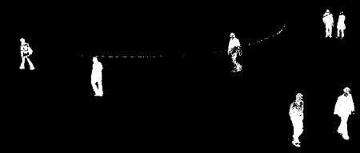
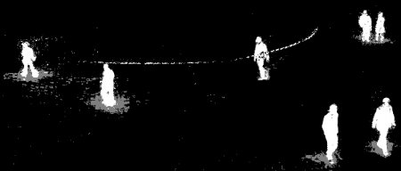

# 背景减法

## 目标

在本章中，

- 我们将熟悉在OpenCV里几种可行的背景减除方法

## 基础

背景减法是许多基于计算机视觉应用的主要预处理操作。举个例子，想象一下一个固定在柜台的摄像机需要计算进来与出去房间的人的数量的情况抑或是提取有关车辆等信息的交通摄像头等等。在所有这些情况下，首先你需要做的便是单独提取出人抑或是交通工具。从技术上来讲，你需要从静态的背景中提取出移动的前景。

如果你只有背景图像，像是没有访客的房间图像，没有车辆的道路图像等等，进行背景减法将是一件容易的事。只需要从背景图像中减去新图像。你便能得到前景对象了。但是，在大多数情况下，你可能并没有这样的图片，所以你需要从我们拥有的任何图像中提取背景。当车辆有阴影时情况会变得更加复杂。由于阴影也会移动，因此简单的减法也会将其标记为前景。这使得背景减除变得复杂。

为此我们引入了几种算法。OpenCV已经实现了三种很容易使用的算法。我们将逐一看到它们。

### BackgroundSubtractorMOG

这是一个基于高斯混合背景/前景分割的算法。这个算法在P. KadewTraKuPong和R. Bowden于2001年的论文“[一种改进的自适应背景混合模型，用于带阴影检测的实时跟踪](http://www.ee.surrey.ac.uk/CVSSP/Publications/papers/KaewTraKulPong-AVBS01.pdf)”中被引出。这个算法使用K个高斯模型进行混合用以表征背景中各个像素点(K = 3 到 5)。每个高斯模型的权值代表着当前场景下各种颜色所占时间的比例。而可能是背景的颜色则停留时间更长且更具静态性。

当我们编写程序的时候，我们需要使用[**cv.createBackgroundSubtractorMOG()**](https://docs.opencv.org/4.0.0/d2/d55/group__bgsegm.html#ga17d9525d2ad71f74d8d29c2c5e11903d)函数创建背景对象。这个函数有一些可选参数，像是用于构建背景模型的帧数，混合的高斯模型个数，阈值等等。将它们全部设定为默认值。然后在视频循环中，使用backgroundsubtractor.apply()函数获取前景蒙版。

下面是一个简单的例子：

```python
import numpy as np
import cv2 as cv

cap = cv.VideoCapture('vtest.avi')

fgbg = cv.bgsegm.createBackgroundSubtractorMOG()

while(1):
    ret, frame = cap.read()
    
    fgmask = fgbg.apply(frame)
    
    cv.imshow('frame',fgmask)
    k = cv.waitKey(30) & 0xff
    if k == 27:
        break
        
cap.release()
cv.destroyAllWindows()
```

(所有结果都在最后给出以供比较)

### BackgroundSubtractorMOG2

这也是一个基于高斯混合背景/前景分割的算法。这个算法基于Z.Zivkovic于2004年发布的“[改进的自适应高斯混合模型用于背景减法](http://www.zoranz.net/Publications/zivkovic2004ICPR.pdf)”和“[2006年发布的“用于背景减法任务的每个图像像素的有效自适应密度估计](http://zoranz.net/Publications/zivkovicPRL2006.pdf)”两篇论文。该算法的一个重要的特征便是它为每一个像素点均选择适当数量的高斯分布。(记住，在最后一种情况，我们在整个算法中利用了K高斯模型)。它应对不同场景中光照变化等因素将提供更好的适应性。

在上一种情况中，我们创建了一个背景减法器的对象。在这里，你可以选择是否检测阴影。如果 detectShadows = True (默认是True)，它将检测并遮罩阴影部分，但这样会降低计算速度。阴影将会被标记为灰色。

```python
import numpy as np
import cv2 as cv

cap = cv.VideoCapture('vtest.avi')

fgbg = cv.createBackgroundSubtractorMOG2()

while(1):
    ret, frame = cap.read()
    
    fgmask = fgbg.apply(frame)
    
    cv.imshow('frame',fgmask)
    k = cv.waitKey(30) & 0xff
    if k == 27:
        break
        
cap.release()
cv.destroyAllWindows()
```

(结果在最下方给出)

### BackgroundSubtractorGMG

这个算法结合了

```python
import numpy as np
import cv2 as cv

cap = cv.VideoCapture('vtest.avi')

kernel = cv.getStructuringElement(cv.MORPH_ELLIPSE,(3,3))
fgbg = cv.bgsegm.createBackgroundSubtractorGMG()

while(1):
    ret, frame = cap.read()
    
    fgmask = fgbg.apply(frame)
    fgmask = cv.morphologyEx(fgmask, cv.MORPH_OPEN, kernel)
    
    cv.imshow('frame',fgmask)
    k = cv.waitKey(30) & 0xff
    if k == 27:
        break
        
cap.release()
cv.destroyAllWindows()
```

## 结果

**原始帧**

下面这张图片展示了一个视频的第200帧


<center>resframe image</center>

**使用BackgroundSubtractorMOG后**



<center>resmog image</center>

**使用BackgroundSubtractorMOG2后**

灰色区域显示阴影区域



<center>resmog2 image</center>

**使用BackgroundSubtractorGMG后**

通过数学形态学中的开运算移除噪声


<center>resgmg image</center>

## 其他资源

## 练习