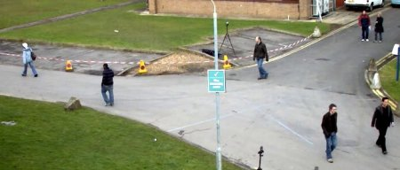
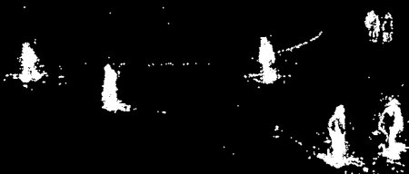

# 背景减法

## 目标

在本章中，

- 我们将熟悉在OpenCV里几种可行的背景减除方法

## 基础

背景减法是许多基于计算机视觉应用的主要预处理操作。举个例子，想象一下一个

### BackgroundSubtractorMOG

```python
import numpy as np
import cv2 as cv

cap = cv.VideoCapture('vtest.avi')

fgbg = cv.bgsegm.createBackgroundSubtractorMOG()

while(1):
    ret, frame = cap.read()
    
    fgmask = fgbg.apply(frame)
    
    cv.imshow('frame',fgmask)
    k = cv.waitKey(30) & 0xff
    if k == 27:
        break
        
cap.release()
cv.destroyAllWindows()
```

(所有结果都在最后给出以供比较)

### BackgroundSubtractorMOG2

```python
import numpy as np
import cv2 as cv

cap = cv.VideoCapture('vtest.avi')

fgbg = cv.createBackgroundSubtractorMOG2()

while(1):
    ret, frame = cap.read()
    
    fgmask = fgbg.apply(frame)
    
    cv.imshow('frame',fgmask)
    k = cv.waitKey(30) & 0xff
    if k == 27:
        break
        
cap.release()
cv.destroyAllWindows()
```

(结果在最下方给出)

### BackgroundSubtractorGMG

```python
import numpy as np
import cv2 as cv

cap = cv.VideoCapture('vtest.avi')

kernel = cv.getStructuringElement(cv.MORPH_ELLIPSE,(3,3))
fgbg = cv.bgsegm.createBackgroundSubtractorGMG()

while(1):
    ret, frame = cap.read()
    
    fgmask = fgbg.apply(frame)
    fgmask = cv.morphologyEx(fgmask, cv.MORPH_OPEN, kernel)
    
    cv.imshow('frame',fgmask)
    k = cv.waitKey(30) & 0xff
    if k == 27:
        break
        
cap.release()
cv.destroyAllWindows()
```

## 结果

**原始帧**

下面这张图片展示了一个视频的第200帧



<center>resframe image</center>

**使用BackgroundSubtractorMOG后**


<center>resmog image</center>

**使用BackgroundSubtractorMOG2后**

灰色区域显示阴影区域


<center>resmog2 image</center>

**使用BackgroundSubtractorGMG后**

通过数学形态学中的开运算移除噪声



<center>resgmg image</center>

## 其他资源

## 练习