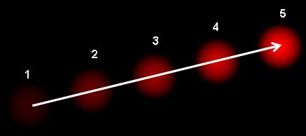

# 光流

## 目标

在本章中

- 我们将理解光流的概念并且使用使用Lucas-Kanade方法估计它。
- 我们将使用像是[ **cv.calcOpticalFlowPyrLK()** ](https://docs.opencv.org/4.0.0/dc/d6b/group__video__track.html#ga473e4b886d0bcc6b65831eb88ed93323)的函数来跟踪视频中的特征点。

## 光流

(图片提供：[维基百科的光流词条](https://en.wikipedia.org/wiki/Optical_flow))



<center>optical flow basic image</center>


```python
import cv2 as cv
import numpy as np

cap = cv.VideoCapture("vtest.avi")

ret, frame1 = cap.read()
prvs = cv.cvtColor(frame1,cv.COLOR_BGR2GRAY)
hsv = np.zeros_like(frame1)
hsv[...,1] = 255

while(1):
    ret, frame2 = cap.read()
    next = cv.cvtColor(frame2,cv.COLOR_BGR2GRAY)
    
    flow = cv.calcOpticalFlowFarneback(prvs,next, None, 0.5, 3, 15, 3, 5, 1.2, 0)
    
    mag, ang = cv.cartToPolar(flow[...,0], flow[...,1])
    hsv[...,0] = ang*180/np.pi/2
    hsv[...,2] = cv.normalize(mag,None,0,255,cv.NORM_MINMAX)
    bgr = cv.cvtColor(hsv,cv.COLOR_HSV2BGR)
    
    cv.imshow('frame2',bgr)
    k = cv.waitKey(30) & 0xff
    if k == 27:
        break
    elif k == ord('s'):
        cv.imwrite('opticalfb.png',frame2)
        cv.imwrite('opticalhsv.png',bgr)
    prvs = next
    
cap.release()
cv.destroyAllWindows()
```


结果如下图：

OpenCV附带有一个关于密集光流的更加高级的样例。请看文件samples/python/opt_flow.py。

## 其他资源

## 练习

1. 查看samples/python/lk_track.py文件的代码并尝试着理解它。
2. 查看samples/python/opt_flow.py的代码并尝试着理解它。