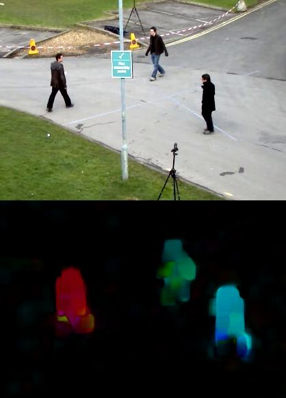

# 光流

## 目标

在本章中

- 我们将理解光流的概念并且使用使用Lucas-Kanade方法估计它。
- 我们将使用像是[ **cv.calcOpticalFlowPyrLK()** ](https://docs.opencv.org/4.0.0/dc/d6b/group__video__track.html#ga473e4b886d0bcc6b65831eb88ed93323)的函数来跟踪视频中的特征点。

## 光流

光流是由于对象或者相机的移动引起的两个连续帧之间的时变图像的运动模式。这是一个二维的矢量场，其中，每一个矢量都是一个位移矢量用以显示从第一帧到第二帧的点的移动(位移)。思考下面的这张图片(图片提供：[维基百科的光流词条](https://en.wikipedia.org/wiki/Optical_flow))


<center>optical flow basic image</center>

这张图片展示了一个小球连续5帧的运动轨迹。箭头所展示的便是位移矢量。

光流在很多领域都有着很多的应用，如：

- 3D重建
- 视频压缩
- 视频防抖
- ...

光流的概念基于以下假设：

- 对象的像素强度在连续帧之间不变化
- 相邻像素具有相似的运动

思考第一帧的一个像素$$I(x,y,t)​$$(注意我们在这里添加了维度与时间概念。在之前我们只处理图像，所以不需要时间)。这个像素将在$$dt​$$时间后的下一帧移动$$(dx,dy)​$$的距离。因此在那些像素点不会变化且亮度也不发生改变之后，我们可以说：
$$
{\notag}
I(x,y,t) = I(x+dx, y+dy, t+dt)
$$
然后采用泰勒级数右近似，删除常数项并同时除以$$dt​$$便最终得到了下面这个方程：
$$
{\notag}
f_x u + f_y v + f_t = 0 \;
$$
其中：
$$
{\notag}
f_x = \frac{\partial f}{\partial x} \; ; \; f_y = \frac{\partial f}{\partial y}\\
u = \frac{dx}{dt} \; ; \; v = \frac{dy}{dt}
$$
上面的方程便是光流方程了。其中，我们可以找到$$f_x$$和$$f_y$$，它们是图像的梯度。同样，$$f_t$$是时间的梯度。但是$$(u,v)​$$我们并不知道。我们不能带着两个未知变量来求解单个方程定解。所以人们寻找到了几种方案来解决这个问题，其中一种便是Lucas-Kanade方法。

### Lucas-Kanade 方法

我们在之前提到过光流基于” 相邻像素具有相似的运动 “这个假设。Lucas-Kanade方法将在像素点周围建立一个3x3邻域像素系统。因为假设2，所以这九个点有着相同的运动。我们便可以在这九个点中寻找到$$(f_x, f_y, f_t)$$。所以我们的问题现在就变成了如何求解这九个方程组成的方程组，其中所求的两个变量是超定的。所以更好的解决方案则是利用最小二乘法拟合。下面这两个方程便是用以解决两个未知数问题的最终的解决方案。
$$
{\notag}
\begin{bmatrix} u \\ v \end{bmatrix} = \begin{bmatrix} \sum_{i}{f_{x_i}}^2 & \sum_{i}{f_{x_i} f_{y_i} } \\ \sum_{i}{f_{x_i} f_{y_i}} & \sum_{i}{f_{y_i}}^2 \end{bmatrix}^{-1} \begin{bmatrix} - \sum_{i}{f_{x_i} f_{t_i}} \\ - \sum_{i}{f_{y_i} f_{t_i}} \end{bmatrix}
$$
(利用Harris角检测器来检查逆矩阵的相似性。这表明了角落是更好的跟踪点)

所以从使用者的角度来看，这个想法是很简单的，我们给出一些用以跟踪的点，我们接收那些点的光流向量。但是这又有一些问题。到目前为止，我们只不过是在处理一些小动作，所以当出现大动作时便会失败。我们将使用图像金字塔来解决这个问题。当我们沿金字塔向上时，小的动作被移除，大的动作则变成小动作。因此通过在金字塔最高层应用Lucas-Kanade方法，我们得到了小范围的光流。

## 在OpenCV里使用Lucas-Kanade光流算法

OpenCV将这些功能都集成在了一个函数中，[ **cv.calcOpticalFlowPyrLK()**](https://docs.opencv.org/4.0.0/dc/d6b/group__video__track.html#ga473e4b886d0bcc6b65831eb88ed93323)。这里，我们创建了一个用以在视频中跟踪某些点的简单程序。为了决定特征点，我们使用[**cv.goodFeaturesToTrack()**](https://docs.opencv.org/4.0.0/dd/d1a/group__imgproc__feature.html#ga1d6bb77486c8f92d79c8793ad995d541)函数。获取第一帧，并在其中检测Shi-Tomasi角点，然后我们使用Lucas-Kanade光流算法对于这些点进行迭代跟踪。对于函数[**cv.calcOpticalFlowPyrLK()**](https://docs.opencv.org/4.0.0/dc/d6b/group__video__track.html#ga473e4b886d0bcc6b65831eb88ed93323)，我们将前一帧，之前的特征点和下一帧传入函数。它将返回下一组特征点以及状态向量，如果相应的特征点被发现，状态向量的每个元素被设置为1，否则，被置为0。我们将返回的这些点作为下一次迭代中所传递的参数。参照下面的代码：

```python
import numpy as np
import cv2 as cv

cap = cv.VideoCapture('slow.flv')

# ShiTomasi角点检测的参数
feature_params = dict( maxCorners = 100,
                       qualityLevel = 0.3,
                       minDistance = 7,
                       blockSize = 7 )

# Lucas-Kanade光流算法的参数
lk_params = dict( winSize  = (15,15),
                  maxLevel = 2,
                  criteria = (cv.TERM_CRITERIA_EPS | cv.TERM_CRITERIA_COUNT, 10, 0.03))

# 创建一组随机颜色数
color = np.random.randint(0,255,(100,3))

# 取第一帧并寻找角点
ret, old_frame = cap.read()
old_gray = cv.cvtColor(old_frame, cv.COLOR_BGR2GRAY)
p0 = cv.goodFeaturesToTrack(old_gray, mask = None, **feature_params)

# 创建绘制轨迹用的遮罩图层
mask = np.zeros_like(old_frame)

while(1):
    ret,frame = cap.read()
    frame_gray = cv.cvtColor(frame, cv.COLOR_BGR2GRAY)
    
    # 计算光流
    p1, st, err = cv.calcOpticalFlowPyrLK(old_gray, frame_gray, p0, None, **lk_params)
    
    # 选取最佳始末点
    good_new = p1[st==1]
    good_old = p0[st==1]
    
    # 绘制轨迹
    for i,(new,old) in enumerate(zip(good_new,good_old)):
        a,b = new.ravel()
        c,d = old.ravel()
        mask = cv.line(mask, (a,b),(c,d), color[i].tolist(), 2)
        frame = cv.circle(frame,(a,b),5,color[i].tolist(),-1)
    img = cv.add(frame,mask)
    
    cv.imshow('frame',img)
    k = cv.waitKey(30) & 0xff
    if k == 27:
        break
        
    # 更新选取帧与特征点
    old_gray = frame_gray.copy()
    p0 = good_new.reshape(-1,1,2)
    
cv.destroyAllWindows()
cap.release()
```


<center>opticalflow lk image</center>

(这个代码并不会检查下一组选取点是否正确，因此即使图像中任意特征点消失，光流也有可能寻找到可能看起来接近的点作为特征点。所以实际上对于稳定跟踪，需要在特定间隔后重新检查角点。OpenCV里提供了这样的一个样例，它可以每5帧重新寻找特征点，而且还会对光流特征点进行反复检查，以便选择最优特征点。查看samples/python/lk_track.py)

## 在OpenCV里计算稠密光流

Lucas-Kanade 方法是求稀疏光流的一种重要方法(在我们的例子中，使用Shi-Tomasi算法检测到角点)。而OpenCV提供了另一种算法用以计算稠密光流。这个方法将计算一帧中所有点的光流。这个方法基于Gunner Farneback算法，该算法在Gunner Farneback于2003年的所著的“[基于多项式展开的双帧运动估计](http://www.diva-portal.org/smash/get/diva2:273847/FULLTEXT01.pdf)“论文中做了解释。

下面的例子将展示如何利用上面的算法寻找稠密光流。我们得到一个带有光流向量的双通道矩阵，$$(u,v)$$。我们将寻找其大小与方向。各种颜色代码用以获得更好的视觉效果。方向对应于图像的色相值。而大小则对应明度位面。代码如下：

```python
import cv2 as cv
import numpy as np

cap = cv.VideoCapture("vtest.avi")

ret, frame1 = cap.read()
prvs = cv.cvtColor(frame1,cv.COLOR_BGR2GRAY)
hsv = np.zeros_like(frame1)
hsv[...,1] = 255

while(1):
    ret, frame2 = cap.read()
    next = cv.cvtColor(frame2,cv.COLOR_BGR2GRAY)
    
    flow = cv.calcOpticalFlowFarneback(prvs,next, None, 0.5, 3, 15, 3, 5, 1.2, 0)
    
    mag, ang = cv.cartToPolar(flow[...,0], flow[...,1])
    hsv[...,0] = ang*180/np.pi/2
    hsv[...,2] = cv.normalize(mag,None,0,255,cv.NORM_MINMAX)
    bgr = cv.cvtColor(hsv,cv.COLOR_HSV2BGR)
    
    cv.imshow('frame2',bgr)
    k = cv.waitKey(30) & 0xff
    if k == 27:
        break
    elif k == ord('s'):
        cv.imwrite('opticalfb.png',frame2)
        cv.imwrite('opticalhsv.png',bgr)
    prvs = next
    
cap.release()
cv.destroyAllWindows()
```

结果如下图：



<center>optical fb image</center>

OpenCV附带有一个关于稠密光流的更加高级的样例。请看文件samples/python/opt_flow.py。

## 其他资源

## 练习

1. 查看samples/python/lk_track.py文件的代码并尝试着理解它。
2. 查看samples/python/opt_flow.py的代码并尝试着理解它。