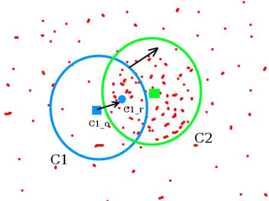

# Meanshift和Camshift

## 目标

在本章中，

- 我们将学习如何让利用Meanshift 和 Camshift算法用以在视频中寻找并跟踪对象

译者注：

Meanshift 中译均值漂移聚类， Camshift则是连续自适应Meanshift算法，<br>以下均用英文表示这两个名词。

## Meanshift

Meanshift背后的直观感受是很简单的。想象一下，你有一堆的随机散列点(这些点可以是像直方图反向投影那样的像素分布)。同时你拥有一个小窗口(或许是一个圆圈)，现在你需要移动这个窗口直到窗口内的像素密度最大(或者说所含点的数量最多)。这在下面这幅图像中是很容易说明的：



<center>meanshift image</center>

起始窗口“C1”如蓝色圆圈所示，其中心区域被蓝色矩形所标记，且命名为“C1_o”。但是，如果你寻找那个窗口的质心，你将会得到点“C1_r”(用蓝色小圆圈标记)，它是窗口真正的质心。显而易见它们并不匹配。因此移动窗口似的新窗口的中心与之前的质心相匹配，此时将再次找到新的质心。最有可能的是，质心与中心两个依旧不匹配。因此，再次移动窗口，并持续迭代下去，使得窗口中心与质心落在同一位置(或者期望误差较小)。所以最终你获得的便是一个包含有最大像素分布的窗口。将其标注为绿色圆圈，命名为“C2”。正如你在图片中看到的那样，这个窗口所包含的点的数量也是最多的。整个过程在下面的动图中有演示：


<center>meanshift face image</center>

所以我们通常会传递直方图反向投影图像和起始目标位置。当物体移动的时候，显然运动将会反应在直方图的反向投影图像中。最终，meanshift算法将窗口移动到具有最大密度的新位置。

### 在opencv中使用Meanshift

为了在OpenCV中使用meanshift，首先我们需要设置目标，寻找其直方图以便我们可以对于反向投影每一帧的直方图用以利用Meanshift算法进行计算。我们还需要提供窗口的起始位置。对于直方图，在此时仅需考虑色相。此外，为了避免由于低亮度引起的错误值，使用[cv2.inRange()](https://docs.opencv.org/4.0.0/d2/de8/group__core__array.html#ga48af0ab51e36436c5d04340e036ce981)函数丢弃低亮度值。

```python
import numpy as np
import cv2 as cv

cap = cv.VideoCapture('slow.flv')

# 获取视频的第一帧
ret,frame = cap.read()

# 设置窗口的初始位置
r,h,c,w = 250,90,400,125  # 简单地硬编码值
track_window = (c,r,w,h)

# 设置ROI(图像范围)以进行跟踪
roi = frame[r:r+h, c:c+w]
hsv_roi =  cv.cvtColor(roi, cv.COLOR_BGR2HSV)
mask = cv.inRange(hsv_roi, np.array((0., 60.,32.)), np.array((180.,255.,255.)))
roi_hist = cv.calcHist([hsv_roi],[0],mask,[180],[0,180])
cv.normalize(roi_hist,roi_hist,0,255,cv.NORM_MINMAX)

# 设置结束标志，10次迭代或至少1次移动
term_crit = ( cv.TERM_CRITERIA_EPS | cv.TERM_CRITERIA_COUNT, 10, 1 )

while(1):
    ret ,frame = cap.read()
    
    if ret == True:
        hsv = cv.cvtColor(frame, cv.COLOR_BGR2HSV)
        dst = cv.calcBackProject([hsv],[0],roi_hist,[0,180],1)
        
        # 运行meanshift算法用以获取新的位置
        ret, track_window = cv.meanShift(dst, track_window, term_crit)
        
        # 绘制到新图像中
        x,y,w,h = track_window
        img2 = cv.rectangle(frame, (x,y), (x+w,y+h), 255,2)
        cv.imshow('img2',img2)
        
        k = cv.waitKey(60) & 0xff
        if k == 27:
            break
        else:
            cv.imwrite(chr(k)+".jpg",img2)
    else:
        break
cv.destroyAllWindows()
cap.release()
```

我使用的视频中的三个帧如下：


<center>meanshift result image</center>

## Camshift

你细致的观察最后的结果了吗？这里其实有一个问题。就是无论汽车离得摄像机很远还是很近我们的窗口大小总是一样的。这并不好。我们需要根据目标的大小和旋转来适应调整窗口大小。该解决方案又一次来自“OpenCV实验室”，这个算法被称为CAMshift（连续自适应Meanshift算法），并由Gary Bradsky于1998年在他的论文“[用于感知用户界面的计算机视觉面部跟踪](http://opencv.jp/opencv-1.0.0_org/docs/papers/camshift.pdf)”中发布。

这个算法首先利用了meanshift。一旦meanshift收敛，他将自动将窗口的大小更新为$$s = 2 \times \sqrt{\frac{M_{00}}{256}}$$。并且寻找出最佳拟合椭圆的方向。同样的，在缩放后的窗口和先前窗口都会应用meanshift算法。该过程将持续到精确度满足要求。


<center>camshift face image</center>

### 在OpenCV里使用Camshift

它大部分与meanshift相同，但是其返回值是一个旋转的矩阵(这是我们得出的结果)和box参数(用于在下一次迭代中搜索窗口传递)

代码如下：

```python
import numpy as np
import cv2 as cv

cap = cv.VideoCapture('slow.flv')

# 获取视频的第一帧
ret,frame = cap.read()

# 设置窗口的初始位置
r,h,c,w = 250,90,400,125  # 简单地硬编码值
track_window = (c,r,w,h)

# 设置ROI(图像范围)以进行跟踪
roi = frame[r:r+h, c:c+w]
hsv_roi =  cv.cvtColor(roi, cv.COLOR_BGR2HSV)
mask = cv.inRange(hsv_roi, np.array((0., 60.,32.)), np.array((180.,255.,255.)))
roi_hist = cv.calcHist([hsv_roi],[0],mask,[180],[0,180])
cv.normalize(roi_hist,roi_hist,0,255,cv.NORM_MINMAX)

# 设置结束标志，10次迭代或至少1次移动
term_crit = ( cv.TERM_CRITERIA_EPS | cv.TERM_CRITERIA_COUNT, 10, 1 )

while(1):
    ret ,frame = cap.read()
    
    if ret == True:
        hsv = cv.cvtColor(frame, cv.COLOR_BGR2HSV)
        dst = cv.calcBackProject([hsv],[0],roi_hist,[0,180],1)
        
        # 运行Camshift用以获取新的位置
        ret, track_window = cv.CamShift(dst, track_window, term_crit)
        
        # 绘制到新图像中
        pts = cv.boxPoints(ret)
        pts = np.int0(pts)
        img2 = cv.polylines(frame,[pts],True, 255,2)
        cv.imshow('img2',img2)
        
        k = cv.waitKey(60) & 0xff
        if k == 27:
            break
        else:
            cv.imwrite(chr(k)+".jpg",img2)
    else:
        break
cv.destroyAllWindows()
cap.release()
```

我使用的视频中的三个帧如下：


<center>camshift result image</center>

## 其他资源

1. 关于[Camshift](https://fr.wikipedia.org/wiki/Camshift)的法语维基百科页面。(上面的两幅动图出自于此)
2. Bradski, G.R.的 ["Real time face and object tracking as a component of a perceptual user interface"](https://ieeexplore.ieee.org/document/732882) 论文

## 练习

1. OpenCV附带了一个关于camshift交互式演示的Python示例。使用它，拆解它，理解它。